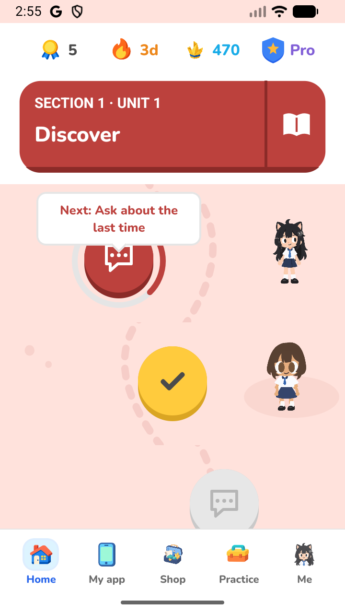
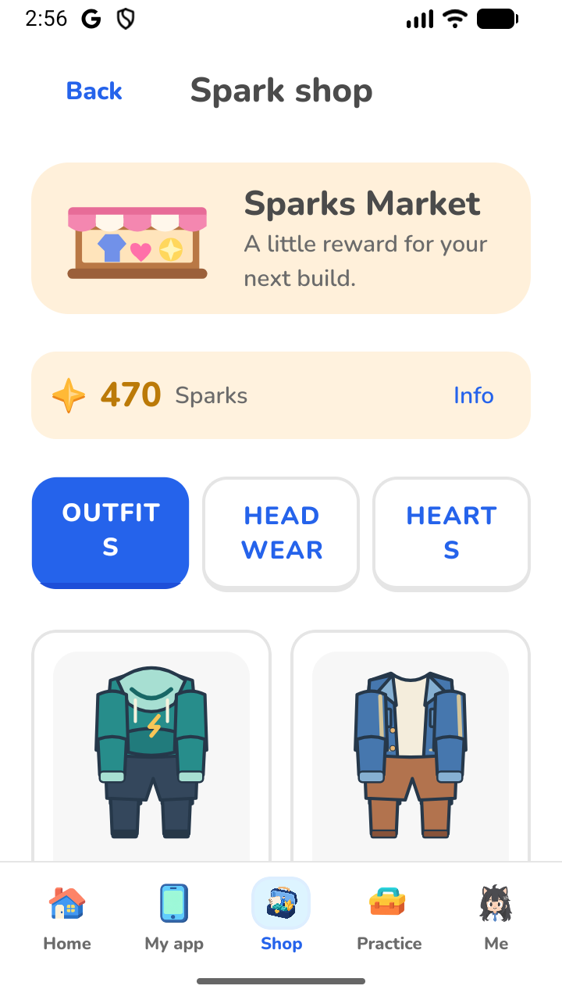

# ShipingIT

**Meet people. Find a need. Build something worth shipping.**

<p align="center">
  
</p>

ShipingIT turns the first steps of making an app into a playful learning journey. Explore a school world, interview fictional characters, sort evidence, choose a small first version, and build a prototype you can actually try. Each lesson helps you make the next decision in your own project.

[Download the Android preview](https://github.com/JNX03/shipingIT/releases/tag/v1.0.0-nextgen-preview.1) · [Set up locally](#run-locally) · [Devpost submission copy](docs/DEVPOST-SUBMISSION.md) · [MIT license](LICENSE)

## A school for shipping

The Home path brings together **eight units, 32 core lessons, 97 authored exercises, 24 builder challenges and six main games**. Short story chapters, original characters and English/Thai vocabulary help give the lessons a setting. Independent practice lets you revisit skills without replaying the whole journey.

| Step | Learn by doing |
| --- | --- |
| Explore | Ask Mali, Noa and Ken about their workarounds; collect useful clues. |
| Insight | Separate the person, problem, cause and need from an unsupported claim. |
| Scope | Fit a first version into a feature budget and resolve dependencies. |
| Design | Arrange and style a screen, then try what you made. |
| Connect | Wire a trigger, action and data to a visible result. |
| Test & ship | Run a task, compare expected and actual behavior, and repair the prototype. |

Learning earns Sparks once. Replays help you practice; they do not inflate your earned rank. The shop offers original outfits and saved heart packs. Reduced motion, tap alternatives to dragging, explicit save states and recovery checks support the same learning flow.

## Three projects to build and try

| Project | What you make | Preview boundary |
| --- | --- | --- |
| Lunch Lens | A lunch queue board with reports, freshness and staff updates. | Simulated school data; no live canteen integration. |
| CampusCompass | A campus map with route comparison and connected directions. | Authored campus/routes; no live GPS or navigation service. |
| StudyBuddy | A study practice app with questions and feedback. | Authored local practice; live AI is off in this prototype. |

Each project has its own saved draft and a **Build / Try / Notes** workspace. These are playable learning prototypes inside ShipingIT. They do not generate or deploy standalone apps.

## Screenshots

<p align="center">
  
  
</p>

Original, unedited Android captures from the reviewed development APK. The progress shown is review data. [Screenshot provenance](docs/screenshots/public/README.md)

## Try the Android preview

The [GitHub Release](https://github.com/JNX03/shipingIT/releases/tag/v1.0.0-nextgen-preview.1) provides the APK and companion verification files. Download the APK, compare its SHA-256 with the release checksum, and install it on Android. Android may ask you to permit installation from your chosen browser or file manager.

This is a **debuggable development preview**, signed with a local debug key. It combines the reviewed JavaScript/assets with an existing compatible native payload. It is not a Google Play release or a fresh full-native build of the final source. RevenueCat purchases use **Test Store / sandbox** and do not represent real charges. There is no tested iOS binary in this release.

Gameplay requires a valid Supabase sign-in. The configured preview's authentication and online features depend on service availability; email confirmation delivery may be limited by the project's development mail setup. Signing in does not create a cloud backup of learning progress or project notes.

## Services and current limits

- **Auth:** Supabase authentication protects learning and project routes. Google sign-in has been exercised on web and Android. A fresh clone needs its own configuration.
- **Ami and character interviews:** optional authenticated requests go through a server-side OpenRouter adapter that checks free-model pricing. Authenticated Ami and Noa web replies were recorded with no provider usage reported at that check. Native live AI and model feedback on typed answers have not been accepted. Authored fallback advice is labeled separately; AI never controls grades or rewards.
- **Pro:** RevenueCat offerings supply products and localized prices. Pro adds step-by-step helpers, eight bonus labs, unlimited shop Sparks and full Project Pack export/copying. Native Test Store purchase and restore were verified on an earlier compatible build; its test access later expired. Full owned export remains unverified. Core learning stays free after sign-in.
- **Local data:** progress, the notebook and independent project drafts save on the device. Cloud sync, unlimited projects, production subscriptions and higher paid AI quotas are not supplied. Export important work before resetting or removing the app.

[Preview scope and verification](docs/PREVIEW-SCOPE.md) separates implemented behavior from actual checks.

## Run locally

Use **Node.js 22.14+ and npm**. The lockfile is `package-lock.json`; the app uses [Expo SDK 57](https://docs.expo.dev/versions/v57.0.0/), React Native 0.86 and React 19.2.

```powershell
git clone https://github.com/JNX03/shipingIT.git
cd shipingIT
npm ci
Copy-Item .env.example .env.local
```

For a new clone, fill these fields in the ignored `.env.local` before starting:

| Configuration | Required? | Purpose |
| --- | --- | --- |
| `EXPO_PUBLIC_SUPABASE_URL` | Yes | Your Supabase project URL. |
| `EXPO_PUBLIC_SUPABASE_PUBLISHABLE_KEY` | Yes | Your project's public publishable key, never a service-role secret. |
| `EXPO_PUBLIC_AUTH_REDIRECT_URL` | Native | Keep `shipaton-nextgen://auth/callback` for the existing app identity. |
| Google/Apple enable flags | Optional | Enable only after configuring the matching Supabase provider and callbacks. |
| Mentor/interview/opportunity URLs | Optional | Endpoints for your configured backend. Authored practice needs no AI key. |
| RevenueCat fields | Optional | Your public platform SDK keys and matching entitlement/offering. Purchases default off. |

All `EXPO_PUBLIC_*` values are embedded in the client and readable by users. Keep model credentials and other server secrets in the service environment. See [Expo environment-variable guidance](https://docs.expo.dev/guides/environment-variables/), [backend setup](docs/BACKEND-SETUP.md) and [integration contracts](docs/INTEGRATIONS.md).

```powershell
npm run web
# Or start the native development server:
npm start
```

Sign in with a confirmed account to enter the learning path. An unconfigured clone can open public account/welcome screens but cannot play. The native billing integration needs a compatible custom native build; Expo Go does not prove a purchase. The shipped preview APK runs its embedded bundle and is separate from a Metro development session. See [Expo development builds](https://docs.expo.dev/develop/development-builds/introduction/).

## Architecture

| Location | Responsibility |
| --- | --- |
| `src/app/` | Expo Router routes and layouts. |
| `src/screens/`, `src/components/`, `src/theme/` | Screens, reusable controls and design tokens. |
| `src/data/`, `src/domain/` | Authored curriculum, learning rules and progression. |
| `src/game/` | World scenes, six-stage games, practice and prototype builders. |
| `src/store/` | Zustand state, local persistence, reward ledger and save/recovery queues. |
| `src/services/` | Auth, AI, offerings, access policies and service response contracts. |
| `src/server/` | Shared HTTP handlers, model adapters and authenticated request validation. |
| `supabase/` | Edge Function entry, private quota migration and hosted checks. |
| `assets/`, `docs/` | Local runtime art, setup guides and asset provenance. |

The hosted adapter enforces a shared authenticated daily AI-attempt quota in PostgreSQL. The local Node server uses an in-memory quota. Optional WebMCP tools expose a limited project/progress projection and visible navigation; they cannot complete stages or award Sparks.

## Checks and builds

```powershell
npm run lint
npm run typecheck
npm test
npm run build
```

The reviewed runtime source passed lint, TypeScript and 864 automated tests. Tests cover learning rules, independent drafts, persistence/recovery, reward replay guards, auth/billing boundaries and service contracts. JavaScript exports do not create native binaries or establish complete device acceptance.

For the existing Windows Android workflow, see [native build instructions](docs/NATIVE-BUILD.md) and [build profiles](docs/SHIPINGIT-BUILD-PROFILES.md). Generated `android/` and `ios/` folders stay out of version control; native changes belong in app configuration/plugins. Add Expo dependencies with `npx expo install <package>`.

The repository is not currently linked/configured for EAS. A future cloud build needs the owner's EAS project, signing and build-profile setup; follow [EAS Build setup](https://docs.expo.dev/build/setup/). The preview APK was not built by EAS. Production stores need separate signing, products, disclosures and native acceptance.

The existing application ID `com.dekport.shipaton.nextgen` and callback scheme `shipaton-nextgen` are preserved for update/auth compatibility. The displayed app name is **ShipingIT**.

## Contributing and license

Keep changes focused, preserve the save/reward rules, and run lint and typecheck before opening a pull request. Do not commit credentials, account screenshots or local environment files. Report bugs through [GitHub Issues](https://github.com/JNX03/shipingIT/issues) with the platform, preview version and reproduction steps.

Application source uses the [MIT license](LICENSE), with the Expo starter notice retained. Dependencies, fonts, artwork and brand rights are explained in [third-party notices](THIRD-PARTY-NOTICES.md), [asset provenance](docs/ASSETS.md) and [game artwork records](docs/SHIPINGIT-ART.md).
